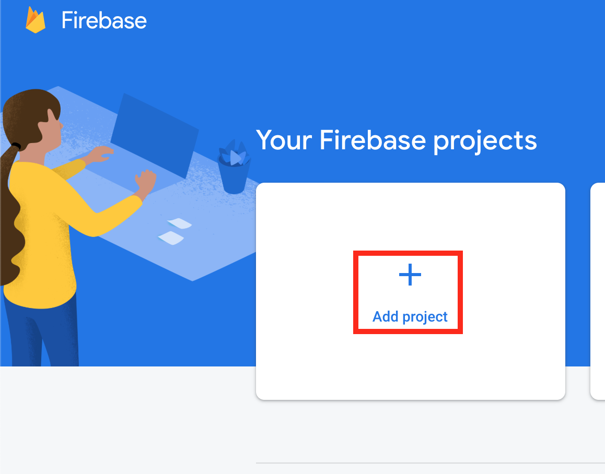

---

title: "Setup Firebase with React"

date: "2019-10-29"
featuredImage: "../../assets/blog/firebase.png"
categories:
  - React
  - All
---

For non programmers, firebase is a database on the cloud. While normal databases use http, firebase uses websockets which are much faster than http. Websockets are mostly used in chat apps where querying the database occurs at a higher frequency.

Firebase’s competition is Amazon Web Services (AWS) and the latter is much difficult to learn for beginners.

## Step 1. Installation

Go to  **console**  on the upper right of the firebase page. This requires you to have an already logged in google account.

<!--  -->

<br/>

Then Click  **Add Project**  

<br/>

After creating the project, it is time to get a piece of code to be used inside your react app. Click on the gear icon next to  ```Project Overview```

Scroll down and then you should see the snippet. You need the snippet in your react app.

<br/>

Then create a database

<br/>

Select Test

<br/>


## Step 2 – Create your React app

On your terminal, type

    create-react-app project

After installing, cmd into the project folder and install firebase

    npm install firebase

Then create a file inside the source folder called firebase.js and add the following

**firebase.js**

    import firebase from 'firebase/app'
    
    import 'firebase/firestore'
    
      var firebaseConfig = {
        apiKey: "test",
        authDomain: "test.firebaseapp.com",
        databaseURL: "test",
        projectId: "test",
        storageBucket: "test",
        messagingSenderId: "test",
        appId: "test",
        measurementId: "test"
      };
    
      // Initialize Firebase
      firebase.initializeApp(firebaseConfig);
      export default firebase

**Optional**: Environmental Variables

 - Create a .env file outside of your source folder
 - Insert ```REACT_APP_FIREBASE_API_KEY=xxx``` and then save
 - In your firebase.js, add process.env.REACT_APP_FIREBASE_API_KEY in the place of your key
 - Add .env inside your gitignore file

## Step 3 – Testing

To Test if your database is connected, add the following code inside your

    import React from 'react';
    import firebase from './firebase'
    firebase.firestore().collection("times").add({
      title: 'test',
      time_seconds: 45
    })
    function App() {
      return ();
    }
    export default App;

Run the program using

    npm start

Then go to your firebase console. You should see the data being added to the db

<br/>


## Step 4 – Display Data from firebase

Create a useEffect hook inside your app.js which will call firebase. It needs to be inside component did mount if you are not using react hooks.

After calling firebase, store the data inside the times state

      const [times, setTimes] = useState([])
      useEffect(() => {
            const unsubscribe = firebase
                .firestore()
                .collection('times')
                .onSnapshot((snapshot) => {
                    const newTimes = snapshot.docs.map((doc) => ({
                        id: doc.id,
                        ...doc.data()
                    }))
                    setTimes(newTimes)
                })
            // Very important - Close connection to FB
            return () => unsubscribe()
        }, [])

To display the state on the front end, add the following code

    <ol>
        {times.map((time) => (
            <li key={time.id}>
				 {time.title} `{time.time_seconds} s`
		    </li> ))} 
    </ol>


## Step 5 – Add Data to firebase

    const [title, setTitle] = useState('')
    const onSubmit = (e) => {
          e.preventDefault()
          firebase
                .firestore()
                .collection('times')
                .add({
                    title: title
                })
                .then(()=> {
                    setTitle('')
                })
        }
    return (
         <form onSubmit={onSubmit}>
              <label>Title</label>
              <input type="text" value={title} 
                     onChange={e => setTitle(e.currentTarget.value)} />
              <button>Add Time Entry</button>
         </form>
    )


