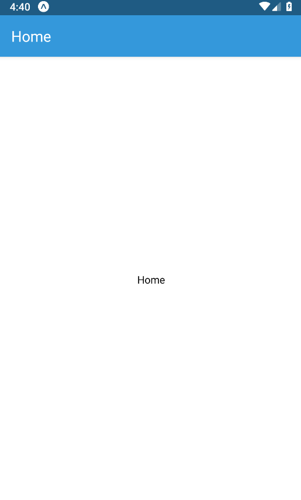

---

title: "React Native Series Part 1 - Project Setup"

date: "2019-11-26"
featuredImage: "../../assets/blog/react.png"
categories:
  - React Native
  - All
---

In this tutorial series, we are going to create an app that takes pictures of public artwork and store the location inside a database which can also be accessed by users around the world. They will be able to view public artworks in your city and rate them.

We will develop the app using expo as it allows quick development in both IOS and Android.


### What we will learn:
- Install react native using expo
- Install React Native Navigation
- Create the Navigation Header
- Create React Native screens
- Add a button in the header


### Step 0: Install React Native using expo


We are going to create the app using expo which is easier to install and learn.

- Install the react expo CLI which is a developer tool for creating projects

```npm install expo-cli --global```

- Create the app using the following command

```expo init my-new-project```


### Step 1: Install React Native Navigation


- Install the following packages

```npm install --save react-navigation```

```expo install react-native-gesture-handler```

```expo install react-native-reanimated```

```npm install --save react-navigation-stack```


### Step 2: Create the Navigation Header

- The AppNavigator file contains a list of routes to different screens
- Create the routes Home (which links to the HomeScreen component), etc...
- The default navigation options will contain styling options
- Then import the AppNavigator file into App.js


<div class="filename">navigation/AppNavigator.js</div>

```jsx
import { Platform } from 'react-native'
import { createAppContainer } from 'react-navigation'
import { createStackNavigator } from 'react-navigation-stack'
import HomeScreen from '../screens/HomeScreen'
import Colors from '../constants/Colors'

const AppNavigator = createStackNavigator({
    Home: HomeScreen
}, {
    defaultNavigationOptions: {
        headerStyle: {
            backgroundColor: Platform.OS === 'android' ? Colors.primaryColor : ''
        },
        headerTintColor: Platform.OS === 'android' ? 'white' : Colors.primaryColor
    }
})
export default createAppContainer(AppNavigator)
```

<div class="filename">App.js</div>

```jsx
import React from 'react';
import AppNavigator from './navigation/AppNavigator'
export default function App() {
  return (
    <>
      <AppNavigator />
    </>
  )
}

```

- Additionally, create a color variable

<div class="filename">constants/Colors.js</div>

```jsx
export default {
    primaryColor: '#3498db'
}
```

### Step 3: Create Home Screen

- All screens should be inside the screen folder.

<div class="filename">screens/HomeScreen.js</div>

```jsx
import React from 'react';
import { View, Text, StyleSheet } from 'react-native';
const HomeScreen = props => {
    return (
        <View style={styles.container}>
            <Text>Home</Text>
        </View>
    );
};
HomeScreen.navigationOptions = navData => {
    return {
        headerTitle: "Home"
    };
};
const styles = StyleSheet.create({
    container: {
        flex: 1,
        backgroundColor: '#FFF',
        alignItems: 'center',
        justifyContent: 'center',
    },
});
export default HomeScreen;
```

### Result




### Step 4: Add a button in the header

- We need to install packages that add buttons inside the AppNavigator

```npm install --save react-navigation-header-buttons```

```npm install --save @expo/vector-icons```


<div class="filename">components/HeaderButton.js</div>

```jsx
import React from 'react';
import {Platform} from 'react-native';
import {HeaderButton} from 'react-navigation-header-buttons';
import {Ionicons} from '@expo/vector-icons';
import Colors from '../constants/Colors';

const CustomHeaderButton = (props) => {
    return (
        <HeaderButton
            {...props}
            IconComponent={Ionicons}
            iconSize={23}
            color={Platform.OS === 'android' ? 'white' : Colors.primaryColor}
        />
    );
};
export default CustomHeaderButton;
```

### Step 5: Add navigation to Homescreen

- Add the navigation code after the return function

<div class="filename">screens/HomeScreen.js</div>

```jsx
import React from 'react';
import HeaderButton from '../components/HeaderButton';
import { HeaderButtons, Item } from 'react-navigation-header-buttons';
import { View, StyleSheet, Button, Platform } from 'react-native';
const HomeScreen = props => {
    const { navigate } = props.navigation;
    return (
        <View style={styles.container}>
            <Button
                title="View All Places"
                onPress={() => navigate('ListPlaces')}
            />
        </View>
    );
};

// NAVIGATION
HomeScreen.navigationOptions = navData => {
    return {
        headerTitle: 'HomeScreen',
        headerRight:
            (<HeaderButtons HeaderButtonComponent={HeaderButton}>
                <Item
                    title="NewPlace"
                    iconName={Platform.OS === 'android' ? 'md-add' : 'ios-add'}
                    onPress={() => {
                        navData.navigation.navigate("NewPlace")
                    }}
                />
            </HeaderButtons>
            )
    }
};

const styles = StyleSheet.create({
    container: {
        flex: 1,
        backgroundColor: '#FFF',
        alignItems: 'center',
        justifyContent: 'center',
    },
});

export default HomeScreen;
```

### Step 6: Create NewPlaceScreen

<div class="filename">screens/NewPlaceScreen.js</div>

```
import React, { useState } from 'react';
import {
    ScrollView,
    View,
    Button,
    Text,
    TextInput,
    StyleSheet
} from 'react-native';
import Colors from '../constants/Colors';

export default NewPlaceScreen = props => {
    const [titleValue, setTitleValue] = useState('');
    const savePlaceHandler = () => {
        props.navigation.goBack();
    };
    return (
        <ScrollView>
            <View style={styles.form}>
                <TextInput style={styles.textInput} onChangeText={(text) => setTitleValue(text)} value={titleValue} placeholder="Title" />
                <Button title="Save Place" color={Colors.primary} onPress={savePlaceHandler} />
            </View>
        </ScrollView>
    );
};
NewPlaceScreen.navigationOptions = { headerTitle: 'Add Place' };

const styles = StyleSheet.create({
    form: {
        margin: 30
    },
    label: {
        fontSize: 18,
        marginBottom: 15
    },
    textInput: {
        borderBottomColor: '#ccc',
        borderBottomWidth: 1,
        marginBottom: 15,
        paddingVertical: 4,
        paddingHorizontal: 2
    }
});

```


### Result:


### Related Posts

- [React Native Series Part 1 - Project Setup](/blog/react-native-series-1)
- [React Native Series Part 2 - Add Redux](/blog/react-native-series-2)
- [React Native Series Part 3 - Access the Camera](/blog/react-native-series-3)
- [React Native Series Part 4 - Setup SQLite and File Management](/blog/react-native-series-4)
- [React Native Series Part 5 - Add Insert SQLite Operation](/blog/react-native-series-5)
- [React Native Series Part 6 - Add Fetch SQLite Operation](/blog/react-native-series-6)
- [React Native Series Part 7 - Add Delete SQLite Operation](/blog/react-native-series-7)