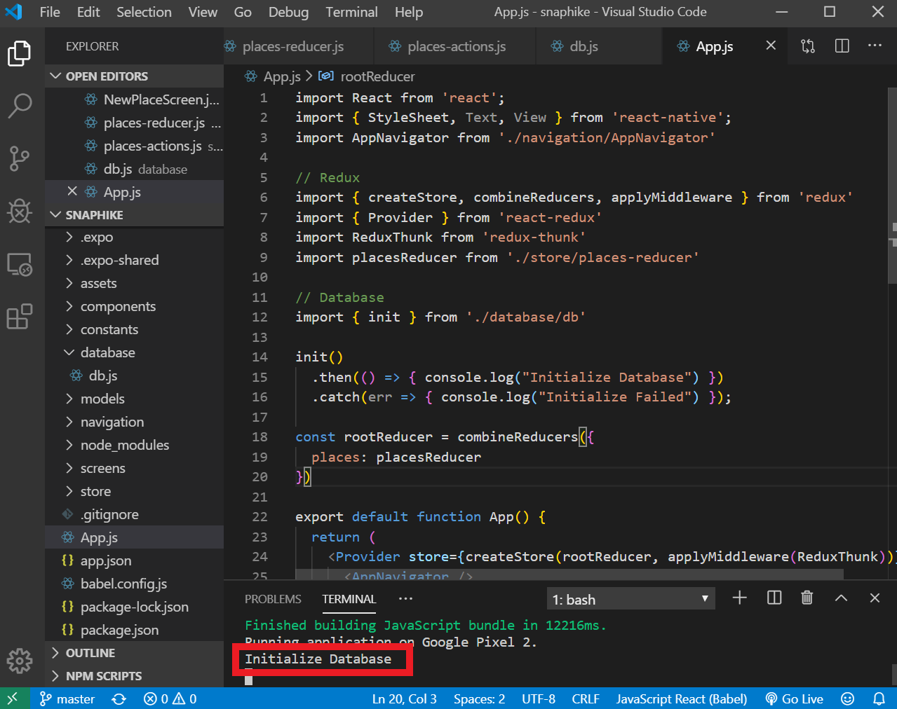

- In the previous post, the images are stored inside a temporary path. When the app is closed, the images will be destroyed. 

- Therefore, we need a way to store the file in a permanent directory which can be achieved using the Native File System

### Step 1 Install the native File System

- Install the file system package

```expo install expo-file-system```

### Step 2: Implement filesystem

- Get the filename (e.g. myfile.jpg) of the image
- Create a new path to permamnent directory using **FileSystem.documentDirectory**
- Then use **FileSystem.moveAsync** to save the image

<div class="filename">store/places-actions.js</div>

```jsx
import * as FileSystem from 'expo-file-system'
export const ADD_PLACE = 'ADD_PLACE';
let previousId = 0;
export const addPlace = (title, location, image) => {
    let id = previousId + 1;
    previousId = id;

    return async dispatch => {

        // Get filename fr0m image .e.g. myimage.jpg
        // Then create a new path
        const newPath = FileSystem.documentDirectory + image.split('/').pop();;

        // The code below takes existing image path and
        // Saves it into the new path on filesystem
        try {
            await FileSystem.moveAsync({ from: image, to: newPath })
        } catch (err) { console.log(err) }

        // Reducer ADD_PLACE (adds an item to store)
        dispatch({
            type: ADD_PLACE,
            placeData: {
                id: id,
                title: title,
                location: location,
                image: newPath
            }
        })
    }
};
```

SQLite
======

- We need SQLite to store data (e.g. title, imageurl) from our app. Otherwise the data will be lost if the user closes it.

- SQLite is available in both ios and android.

### Step 3: Install SQLite

- Install the following package

```expo install expo-sqlite```

### Step 4: Initialize the Database

- Connect to database or create the database if it does not exist with **SQLite.openDatabase**
- Initialise database structure along with tables and fields inside **db.transtion**

<div class="filename">database/db.js</div>

```jsx
import * as SQLite from "expo-sqlite";

// Connect to database or create the database if it does not exist
const db = SQLite.openDatabase('places.db');

// Initialise database structure along with tables and fields
export const initDB = () => {
    const promise = new Promise((resolve, reject) => {
        db.transaction(tx => {
            tx.executeSql(
                'CREATE TABLE IF NOT EXISTS places (id INTEGER PRIMARY KEY NOT NULL, title TEXT NOT NULL, imageUri TEXT NOT NULL, address TEXT NOT NULL, lat REAL NOT NULL, lng REAL NOT NULL);',
                [],
                () => {
                    resolve();
                },
                (_, err) => {
                    reject(err);
                }
            );
        });
    });
    return promise;
};
```

### Step 5: Import the Database configuration in App.js

- We put the init function reight before the main function.


<div class="filename">App.js</div>

```jsx
import { initDB } from './database/db'

initDB()
  .then(() => { console.log("Initialize Database") })
  .catch(err => { console.log("Initialize Failed") });
```

- Run the application and you should see the following result:

<br/>


### Related Posts

- [React Native Series Part 1 - Project Setup](/blog/react-native-series-1)
- [React Native Series Part 2 - Add Redux](/blog/react-native-series-2)
- [React Native Series Part 3 - Access the Camera](/blog/react-native-series-3)
- [React Native Series Part 4 - Setup SQLite and File Management](/blog/react-native-series-4)
- [React Native Series Part 5 - Add Insert SQLite Operation](/blog/react-native-series-5)
- [React Native Series Part 6 - Add Fetch SQLite Operation](/blog/react-native-series-6)
- [React Native Series Part 7 - Add Delete SQLite Operation](/blog/react-native-series-7)