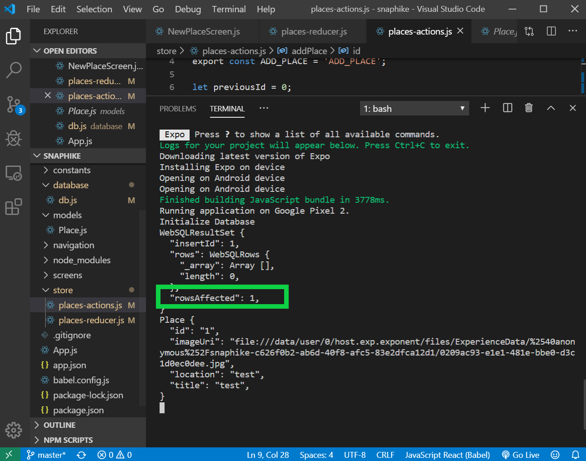
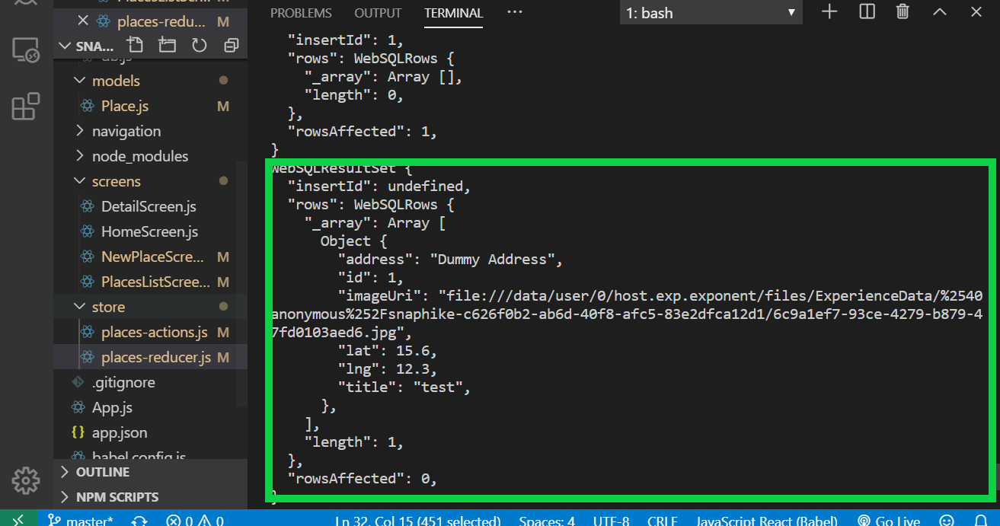

### Insert Data  (C in CRUD)

Step 1 - Add insert function inside **database/db.js**

- Use the INSERT INTO command to add a record to a table (places)
- Inside the parenthesis, add the fields that you want to target except the id

```
// Insert Data into database
export const insertPlace = (title, imageUri, address, lat, lng) => {
    const promise = new Promise((resolve, reject) => {
        db.transaction(tx => {
            tx.executeSql(
                `INSERT INTO places (title, imageUri, address, lat, lng) VALUES (?, ?, ?, ?, ?);`,
                [title, imageUri, address, lat, lng],
                (_, result) => {
                    resolve(result);
                },
                (_, err) => {
                    reject(err);
                }
            );
        });
    });
    return promise;
};

```

Step 2 - Add insert Action inside **places-actions.js**

```
try {
        await FileSystem.moveAsync({
            from: image,
            to: newPath
        })
        // ADD PLACE into DATABASE
        const insertDB = await insertPlace(
            title,
            newPath,
            "Dummy Address",
            15.6,
            12.3
        );
        console.log(insertDB)
        // Reducer ADD_PLACE (adds an item to store)
        dispatch({
            type: ADD_PLACE,
            placeData: {
                id: insertDB.insertId,
                title: title,
                imageUri: newPath
            }
        })
    } catch (err) { console.log(err) }
```

Step 3 - Add insert reducer case inside **store/places-reducer.js**

```
case ADD_PLACE:
    const newPlace = new Place(
        action.placeData.id.toString(),
        action.placeData.title,
        action.placeData.imageUri,
    );
    return {
        places: state.places.concat(newPlace)
    };
```

### Result

Now start the app and add a new place. You should see the result below.

The rows affected: 1 means that one row has been added to the database table.

<br/>


### Fetching Data (R in CRUD)

Step 1 - Add the fetch function inside **database/db.js**

```
// Fetch Data from database
export const fetchPlaces = () => {
    const promise = new Promise((resolve, reject) => {
        db.transaction(tx => {
            tx.executeSql(
                'SELECT * FROM places',
                [],
                (_, result) => {
                    resolve(result);
                },
                (_, err) => {
                    reject(err);
                }
            );
        });
    });
    return promise;
};
```

Step 2 - Add the fetch function inside **store/places-actions.js**

```
export const LOAD_PLACES = 'LOAD_PLACES';
export const loadPlaces = () => {
    return async dispatch => {
        try {
            const dbResult = await fetchPlaces();
            console.log(dbResult);
            dispatch({ type: LOAD_PLACES, places: dbResult.rows._array });
        } catch (err) {
            throw err;
        }
    };
};
```

Step 3 - Add the fetch function inside **store/places/reducer.js**

```
  case LOAD_PLACES:
            return {
                places: action.places.map(
                    pl =>
                        new Place(
                            pl.id.toString(),
                            pl.title,
                            pl.imageUri,
                            pl.address,
                            pl.lat,
                            pl.lng
                        )
                )
            };
```

Step 4 - List the data inside screen **screens/placesListScreen.js**

```
const dispatch = useDispatch();
useEffect(() => {
    dispatch(placesActions.loadPlaces());
}, [dispatch]);
```

### Result:

<br/>


### Related Posts

- [React Native Series Part 1 - Project Setup](/blog/react-native-series-1)
- [React Native Series Part 2 - Add Redux](/blog/react-native-series-2)
- [React Native Series Part 3 - Access the Camera](/blog/react-native-series-3)
- [React Native Series Part 4 - Setup SQLite and File Management](/blog/react-native-series-4)
- [React Native Series Part 5 - Add SQLite Operations (CRUD)](/blog/react-native-series-5)