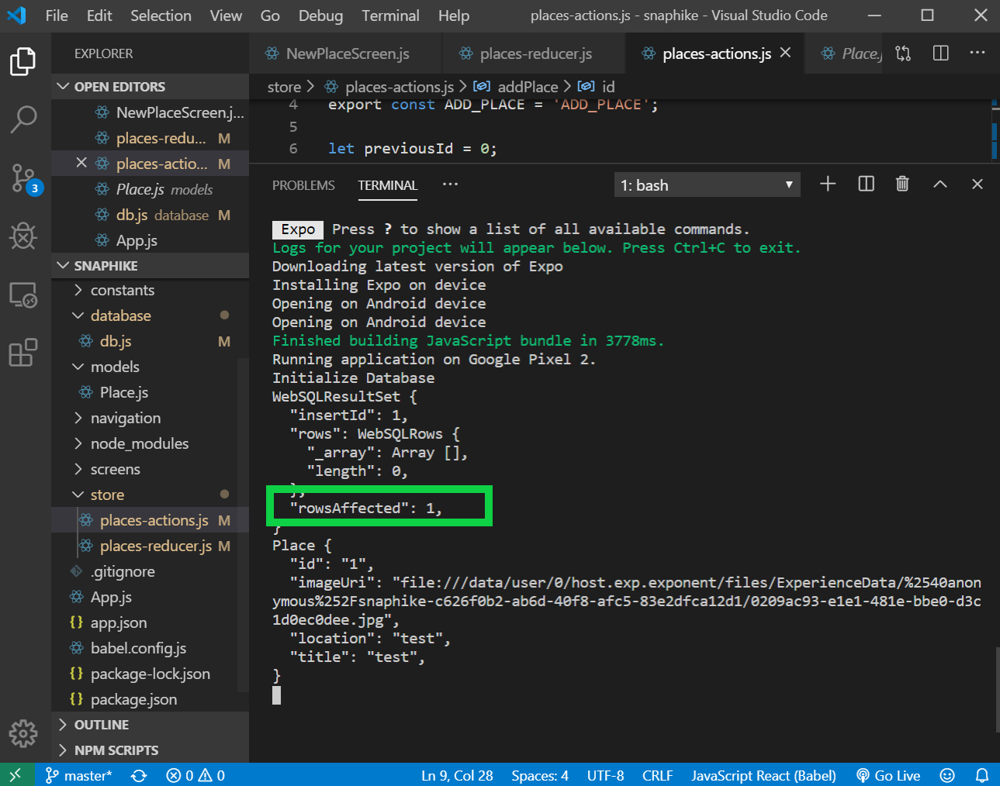

In this post, we are going to add the database Create/Read/Update/Delete functions to the application.

### Step 1 - Add insert function in database

- Use the INSERT INTO command to add a record to a table (places)
- Inside the parenthesis, add the fields that you want to target except the id

<div class="filename">database/db.js</div>

```jsx
// Insert Data into database
export const insertPlace = (title, imageUri, address, lat, lng) => {
    const promise = new Promise((resolve, reject) => {
        db.transaction(tx => {
            tx.executeSql(
                `INSERT INTO places (title, imageUri, address, lat, lng) VALUES (?, ?, ?, ?, ?);`,
                [title, imageUri, address, lat, lng],
                (_, result) => {
                    resolve(result);
                },
                (_, err) => {
                    reject(err);
                }
            );
        });
    });
    return promise;
};

```

### Step 2 - Add insert Action

<div class="filename">store/places-actions.js</div>

```jsx
try {
    await FileSystem.moveAsync({
        from: image,
        to: newPath
    })
    // ADD PLACE into DATABASE
    const insertDB = await insertPlaceDB(
        title,
        newPath,
        "Dummy Address",
        15.6,
        12.3
    );
    // Reducer ADD_PLACE (adds an item to store)
    dispatch({
        type: INSERT_PLACE,
        placeData: {
            id: insertDB.insertId,
            title: title,
            imageUri: newPath
        }
    })
} catch (err) { console.log(err) }
```

### Step 3 - Add insert reducer case

<div class="filename">store/places-reducer.js</div>

```jsx
  case INSERT_PLACE:
    const newPlace = new Place(
        action.placeData.id.toString(),
        action.placeData.title,
        action.placeData.imageUri,
    );
    return {
        places: state.places.concat(newPlace)
    };
```

### Result

- Now start the app and add a new place. You should see the result below.
- The rows affected: 1 means that one row has been added to the database table.

<br/>

### Related Posts

- [React Native Series Part 1 - Project Setup](/blog/react-native-series-1)
- [React Native Series Part 2 - Add Redux](/blog/react-native-series-2)
- [React Native Series Part 3 - Access the Camera](/blog/react-native-series-3)
- [React Native Series Part 4 - Setup SQLite and File Management](/blog/react-native-series-4)
- [React Native Series Part 5 - Add Insert SQLite Operation](/blog/react-native-series-5)
- [React Native Series Part 6 - Add Fetch SQLite Operation](/blog/react-native-series-6)
- [React Native Series Part 7 - Add Delete SQLite Operation](/blog/react-native-series-7)