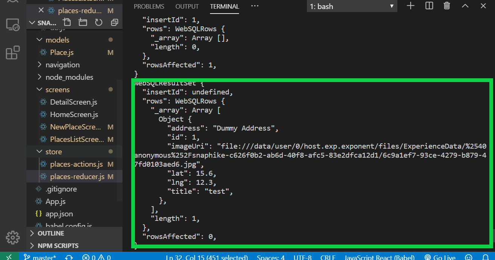

### Fetching Data (R in CRUD)

**Step 1 - Add the fetch function into database**

Inside **database/db.js**

```
// Fetch Data from database
export const fetchPlacesDB = () => {
    const promise = new Promise((resolve, reject) => {
        db.transaction(tx => {
            tx.executeSql(
                'SELECT * FROM places',
                [],
                (_, result) => {
                    resolve(result);
                },
                (_, err) => {
                    reject(err);
                }
            );
        });
    });
    return promise;
};
```

**Step 2 - Add the fetch function inside Actions**

Inside **store/places-actions.js**

```
// FETCH PLACES ACTION
export const FETCH_PLACES = 'FETCH_PLACES';
export const fetchPlacesAction = () => {
    return async dispatch => {
        try {
            const dbResult = await fetchPlacesDB();
            dispatch({ type: FETCH_PLACES, places: dbResult.rows._array });
        } catch (err) {
            throw err;
        }
    };
};
```

**Step 3 - Add the fetch function** 

Inside **store/places/reducer.js**

```
case FETCH_PLACES:
    return {
        places: action.places.map(
            pl =>
                new Place(
                    pl.id.toString(),
                    pl.title,
                    pl.imageUri,
                    pl.address,
                    pl.lat,
                    pl.lng
                )
        )
    };
```

**Step 4 - List the fetched data inside component** 

Inside screen **screens/placesListScreen.js**

```
import { useSelector, useDispatch } from 'react-redux';
...
const dispatch = useDispatch();
useEffect(() => {
    dispatch(placesActions.loadPlaces());
}, [dispatch]);
```

### Result:

Restart the app and go the list all places screen. You should get the following result

<br/>

### Related Posts

- [React Native Series Part 1 - Project Setup](/blog/react-native-series-1)
- [React Native Series Part 2 - Add Redux](/blog/react-native-series-2)
- [React Native Series Part 3 - Access the Camera](/blog/react-native-series-3)
- [React Native Series Part 4 - Setup SQLite and File Management](/blog/react-native-series-4)
- [React Native Series Part 5 - Add Insert SQLite Operation](/blog/react-native-series-5)
- [React Native Series Part 6 - Add Fetch SQLite Operation](/blog/react-native-series-6)
- [React Native Series Part 7 - Add Delete SQLite Operation](/blog/react-native-series-7)